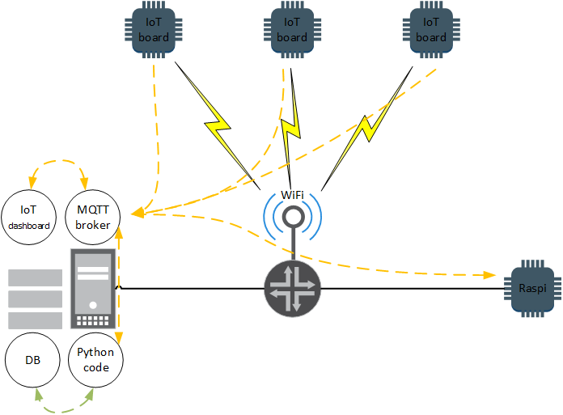

# IoT Smart Home

My own try of achieving "smart" home.

Basic required fetures of system:
* temperature sensors
* humidity sensors
* wind speed and direction sensor
* rain meter sensor
* control of garage door and fence gates
* control of outdoor lights 

Timeline:
* 17.04.2018 - ordered board with ESP-8266 for PoC plus some sensors
* 17.04.2018 - discovered wemos d1 mini, robophery, home-assistant, mqtt

Things to evaluate:
* micropython for use in boards
* mqtt - if it's usable also for communication between pc/server and raspi
* home-assistant - how to, features
* range of wireless connectivity of boards with onboard anttenas
* power consumption - sleep modes, w/ and w/o battery shield
* suitable database for sensor data + grafana to visualize measured data

## High level overview

IoT boards connected to wireless network. Boards with different sensors are sending data via message queue where data are gathered by IoT dashboard and python code which fills database. IoT dashboard and python code at server can communicate with other python code located at RaspberryPi which is controlling outdoor lights, garage and fence gate. Whole "system" is ilustrated on image below. 

